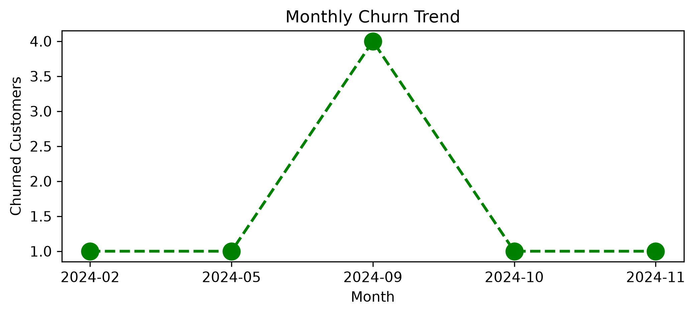
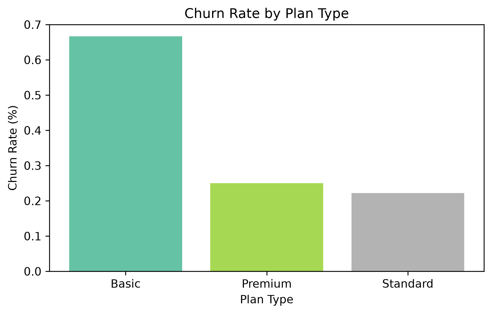
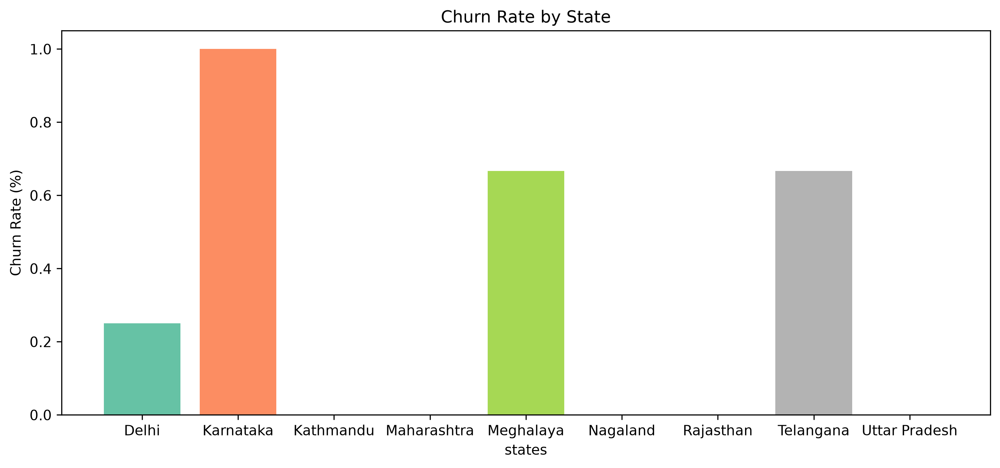
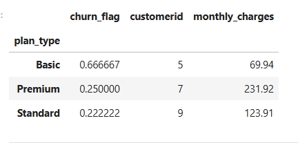

# 📊 Customer Churn Analysis using Python

## 📖 Project Overview

Customer churn is one of the most critical business metrics for subscription-based companies. Retaining existing customers is often more cost-effective than acquiring new ones. This project analyzes customer demographics, subscription details, billing information, and customer support data to identify factors contributing to customer churn.

Using **Python**, this project performs data cleaning, feature engineering, exploratory data analysis (EDA), KPI calculations, and data visualization to uncover churn patterns and provide actionable business recommendations.

---

## 🎯 Project Objectives

* Analyze customer churn behavior.
* Calculate key business KPIs related to churn.
* Identify high-risk customer segments.
* Discover churn trends across subscription plans, states, and time.
* Generate business insights and recommendations to improve customer retention.

---

## 📂 Dataset Information

The project uses three relational tables connected through the **Customer ID**. These tables contain customer demographics, subscription details, and customer support information.

### **1. db_customer**

Contains customer demographic information.

| Column Name |
| ----------- |
| customerid  |
| name        |
| country     |
| state       |
| gender      |
| dob         |
| interests   |
| pincode     |

---

### **2. db_subscription**

Contains customer subscription and billing details.

| Column Name             |
| ----------------------- |
| customerid              |
| subscription_start_date |
| subscription_type       |
| renewal_date            |
| plan_type               |
| contract_type           |
| cancellation_date       |
| cancellation_reason     |
| monthly_charges         |
| cltv                    |
| churn_score             |

---

### **3. db_support**

Contains customer support and complaint information.

| Column Name    |
| -------------- |
| customerid     |
| complaint_date |
| escalations    |
| csat_score     |
| col_1          |
| comment        |

---

### **Database Relationship**

* **db_customer** ↔ **db_subscription** → Connected using **customerid**
* **db_subscription** ↔ **db_support** → Connected using **customerid**
* All three tables were merged using **customerid** to create a single dataset for analysis.

---

## 🛠️ Technologies Used

* Python
* Pandas
* NumPy
* Matplotlib
* Jupyter Notebook

---

## 📌 Project Workflow

1. Imported required libraries.
2. Loaded multiple datasets.
3. Cleaned missing and duplicate values.
4. Merged customer, subscription, and support datasets.
5. Created new features:

   * Customer Age
   * Customer Tenure
   * Churn Risk
6. Performed Exploratory Data Analysis (EDA).
7. Calculated business KPIs.
8. Created visualizations.
9. Performed Pivot Table Analysis.
10. Generated business insights and recommendations.

---

# 📊 Key Performance Indicators (KPIs)

| KPI                               | Value          |
| --------------------------------- | -------------- |
| Churn Rate                        | **34.78%**     |
| Retention Rate                    | **65.22%**     |
| Average Revenue Per User (ARPU)   | **18.51**      |
| Average Customer Tenure           | **1,422 Days** |
| Revenue at Risk                   | **103.94**      |
| Escalation Rate                   | **0.0%**     |
| Average Complaints per Customer   | **1.29**       |
| Correlation (Escalation vs Churn) | **0.0**       |

---

# 📈 Visualizations

The project includes visualizations such as:

### Monthly Churn Trend



### Churn Rate by Plan Type



### Churn Rate by State



### Pivot Table Analysis



---

# 📌 Key Insights

* Overall **Churn Rate is 34.78 %%**, while the **Retention Rate is  65.22 %**.
* The **Basic Plan** has the highest churn rate (**60%**), indicating the need for retention strategies.
* **September 2024** recorded the highest number of customer churns.
* **Karnataka (100%)** and **Meghalaya (66.67%)** have the highest state-wise churn rates.
* Customers acquired through the **Referral** channel show the highest churn rate (**83.33%**).
* Revenue at Risk due to churn is **103.94**.
* A strong positive correlation (**0.77**) exists between customer escalations and churn, indicating unresolved issues significantly increase churn probability.

---

# 💡 Business Recommendations

* Improve the **Basic subscription plan** by enhancing its value and customer benefits.
* Investigate the reasons behind the **September 2024 churn spike**.
* Focus customer retention efforts in **high-churn states** such as Karnataka and Meghalaya.
* Reduce customer complaints by improving support response and issue resolution.
* Prioritize customers with **Medium** and **High churn risk** for targeted retention campaigns.
* Review the **Referral acquisition channel** to improve customer onboarding and retention.

---

# 📂 Project Structure

```text
Customer-Churn-Analysis/
│
├── Customer_Churn_Analysis.ipynb
├── customer_data.csv
├── subscription_data.csv
├── support_data.csv
├── README.md
├── requirements.txt
└── images/
    ├── monthly_churn.png
    ├── churn_by_plan.png
    └── churn_by_state.png
```

---

## 👨‍💻 Author

**Vikas Rajbhar**

---

## ⭐ If you found this project useful, consider giving it a star on GitHub!


[def]: images/monthly_churn_trend.png